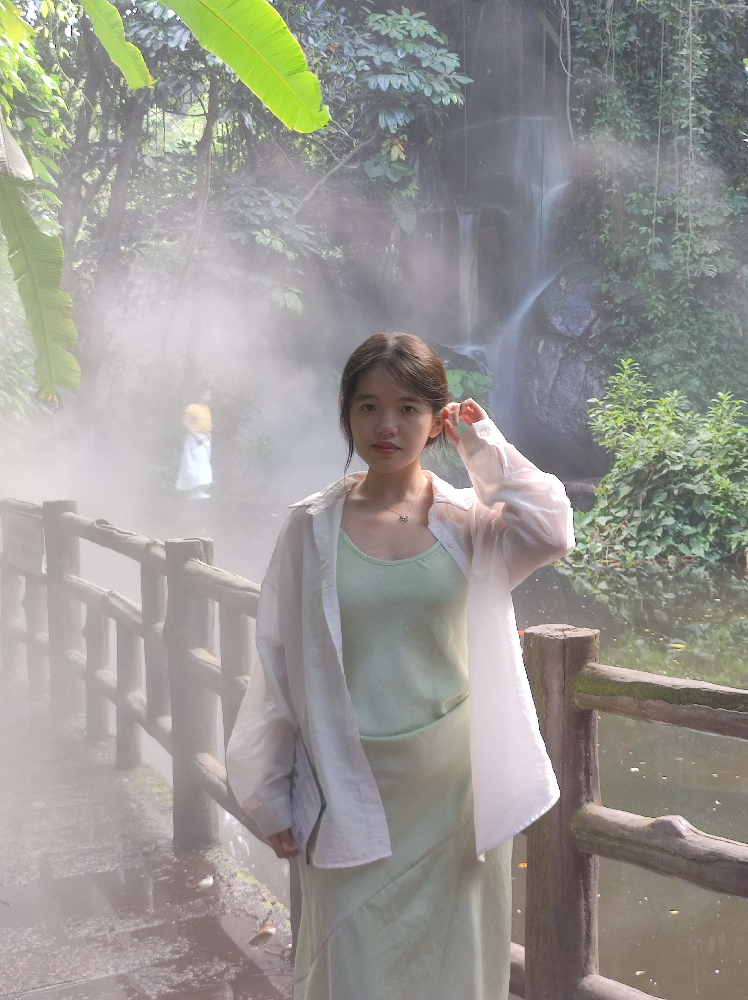

# 个人网站使用说明

## 🚀 快速开始

1. **直接使用**：在浏览器中打开 `index.html` 文件即可查看网站
2. **本地预览**：双击 `index.html` 文件，网站会在默认浏览器中打开

## ✏️ 自定义内容

### 1. 修改个人信息
打开 `config.js` 文件，修改以下内容：

```javascript
personalInfo: {
    name: "你的真实姓名", // 修改这里
    title: "你的身份描述", // 修改这里
    subtitle: "你的个性标语", // 修改这里
    description: "你的个人介绍", // 修改这里
    education: "你的教育背景" // 修改这里
}
```

### 2. 修改技能特长
在 `config.js` 中修改 `skills` 数组：

```javascript
skills: [
    {
        icon: "💻", // 可以更换emoji图标
        name: "你的技能名称",
        description: "技能描述"
    }
    // 可以添加更多技能
]
```

### 3. 修改社交媒体链接
在 `config.js` 中修改 `socialMedia` 对象：

```javascript
socialMedia: {
    xiaohongshu: {
        url: "你的小红书链接", // 修改为真实链接
        description: "自定义描述"
    },
    douyin: {
        url: "你的抖音链接", // 修改为真实链接
        description: "自定义描述"
    },
    wechat: {
        url: "你的微信二维码图片链接", // 可以上传二维码图片
        description: "自定义描述"
    }
}
```

### 4. 更换照片
- 将你的照片文件放在项目根目录
- 在 `index.html` 中找到这行代码：
  ```html
  
  ```
- 将 `3b79c2d130620182898e10196f257352.jpg` 改为你的照片文件名

## 🎨 自定义样式

### 修改颜色主题
在 `config.js` 中修改 `theme` 对象：

```javascript
theme: {
    primaryColor: "#00bcd4",    // 主色调（青色）
    secondaryColor: "#0097a7",  // 次要色调（深青色）
    accentColor: "#26a69a"      // 强调色（青绿色）
}
```

**当前主题**：网站已设置为优雅的青色主题，包括：
- 🎨 主色调：现代青色 (#00bcd4)
- 🌊 背景：渐变青色背景
- ✨ 装饰：浮动的青色装饰元素
- 🎯 按钮：青色渐变按钮

### 修改字体和布局
编辑 `css/style.css` 文件：
- 修改字体：搜索 `font-family` 属性
- 修改间距：搜索 `padding` 和 `margin` 属性
- 修改圆角：搜索 `border-radius` 属性

## 🔧 高级功能

### 1. 个人形象展示
- 🖼️ **照片展示**：展示你的真实个人形象
- ✨ **悬停效果**：鼠标悬停头像时显示交互提示
- 🎨 **优雅设计**：圆形头像配合现代化阴影效果

### 2. 响应式设计
网站已经适配各种设备尺寸：
- 桌面端：1200px以上
- 平板端：768px-1199px
- 手机端：480px-767px
- 小屏手机：480px以下

### 3. 动画效果
- 页面滚动时的渐入动画
- 按钮悬停效果
- 技能卡片动画
- 社交媒体链接悬停效果

## 📱 部署到网络

### 方法1：GitHub Pages（免费）
1. 在GitHub创建新仓库
2. 上传所有文件
3. 在仓库设置中启用GitHub Pages
4. 选择主分支作为源
5. 等待几分钟，网站即可访问

### 方法2：Netlify（免费）
1. 注册Netlify账号
2. 拖拽项目文件夹到Netlify
3. 自动部署完成
4. 获得免费域名

### 方法3：Vercel（免费）
1. 注册Vercel账号
2. 导入GitHub仓库
3. 自动部署完成
4. 获得免费域名

## 🐛 常见问题

### Q: 照片不显示怎么办？
A: 检查照片文件名是否正确，确保照片文件在正确位置

### Q: 如何修改网站标题？
A: 在 `index.html` 中修改 `<title>` 标签内容

### Q: 如何添加更多页面？
A: 创建新的HTML文件，在导航栏中添加链接

### Q: 如何修改AI处理步骤？
A: 在 `config.js` 中修改 `aiAvatar.processingSteps` 数组

## 📚 学习资源

- HTML基础：https://developer.mozilla.org/zh-CN/docs/Web/HTML
- CSS样式：https://developer.mozilla.org/zh-CN/docs/Web/CSS
- JavaScript编程：https://developer.mozilla.org/zh-CN/docs/Web/JavaScript

## 🎯 后续优化建议

1. **添加作品展示页面**：展示你的项目、作业或创意作品
2. **集成真实AI形象生成**：使用AI服务生成真实的AI形象
3. **添加博客功能**：分享你的学习和生活感悟
4. **优化SEO**：添加更多元数据，提高搜索引擎排名
5. **添加联系表单**：让访客可以直接联系你
6. **多语言支持**：添加英文版本，扩大影响力

## 📞 技术支持

如果在使用过程中遇到问题，可以：
1. 检查浏览器控制台是否有错误信息
2. 确认所有文件都在正确位置
3. 尝试清除浏览器缓存
4. 使用不同的浏览器测试

---

**祝你使用愉快！** 🎉
这个个人网站将成为你简历上的亮点，展示你的技术能力和创造力！
